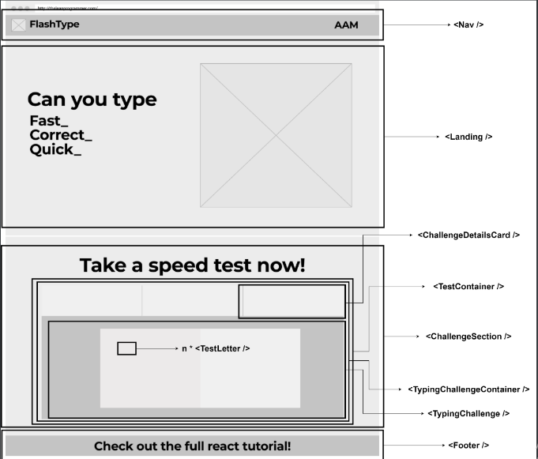
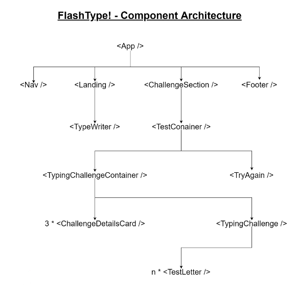

<h1 align="center">
    ⚡ Flash Type ⚡
</h1>

<div align="center">
    


</div>

## ❤️ Note for new Contributors : ❤️

Thank you very much for considering this project. Make sure you read [Code of Conduct](https://github.com/kaiwalyakoparkar/flashtype/blob/master/CODE_OF_CONDUCT.md) and [Contribution Guidelines](https://github.com/kaiwalyakoparkar/flashtype/blob/master/CONTRIBUTING.md) before making contributions. Feel free to raise an issue and after gettting assigned to it, you are all set to work on it.

## 📌About :

This is a react based (side) project intended to practice help you in typing fast and correct. This project is entirely built from scratch. You can see the live demo [Here](https://kaiwalyakoparkar.github.io/flashtype)

## 📌Live Demo:


## 📌Wire Framed Diagram:




## 📌Structural Diagram:



## 📌Pre-requisites

1. Basic Computer configuration
2. Node js installed

## 📌Contribution :

Contribution to this repos are always welcome. You can alwas upgrade the UI, or fix any bug predefined in the issue section.

For new contibution or feature : 

1. Open a new issue describing the feature.
2. Add feature tag to this issue.
3. Get acceptance from the code maintainers
4. Enjoy adding the feature

## 📌Steps to contibute :

1. Fork the project:
Fork the project from https://github.com/kaiwalyakoparkar/flashtype/

2. Clonning the project :
```git
git clone https://github.com/<your-user-name>/flashtype.git
```
3. Open the project in your desired text editor

4. run the following command int terminal to see the live output
```node
npm start
```
5. Now go to the components folder and choose the component you want to add feature to.

6. after specified changes document the changes in changes.md

7. run the following command to generate the build folder
```node
npm run build
```
8. Now deploy the application to your copy
```node
npm deploy
```
9. Now create a pull request to the parent repository

10. Wait for acceptance ! Best of luck

## 📌Contributors & Maintaiers
[Kaiwalya Koparkar](https://kaiwalyakoparkar.github.io/)
